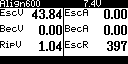
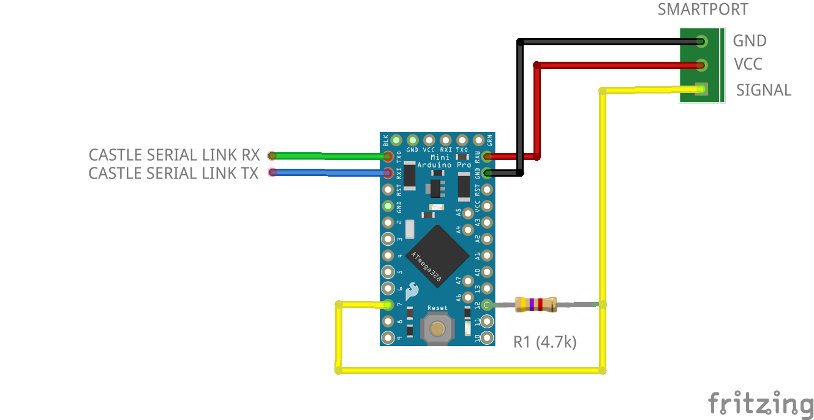

# Castle Serial Link ESC telemetry to FrSky Smartport

Send Castle Serial Link ESC telemetry to Frsky Smartport using an Arduino Pro Mini 168 or 328P (3.3v or 5v)

## ESC telemetry

Interfacing the ESC with [Castle Serial Link](http://www.castlecreations.com/en/serial-link-010-0121-00) it is possible to send the telemetry to Smartport protocol using an Arduino

Telemetry sensors (sensor ID: 10):

- Voltage: sensor EscV (0x0B50)
- Ripple voltage: sensor EscV (0x0B52)
- Current: sensor EscA (0x0B50)
- RPM: sensor EscR (0x0B60)
- BEC voltage: sensor EscV (0x0B51)
- BEC current: sensor EscA (0x0B51)
- Temperature: sensor EscT (0x0B70)
- Temperature NTC: sensor EscT (0x0B71)

Note: my ESC (ICE2HV80) does not output bec and current telemetry 
Note2: some sensors have custom names. This has to be done manually from edit sensor screen in openTx

## Wiring:

 - SmartPort Vcc to Arduino RAW
 - SmartPort Gnd to Arduino Gnd
 - Smartport Signal to Arduino PIN_SMARTPORT_RX (7)
 - Smartport Signal to R1 (4.7k)
 - R1 (4.7k) to Arduino PIN_SMARTPORT_TX (12)
 - Castle Serial Link Rx to Arduino Tx
 - Castle Serial Link Tx to Arduino Rx

## Adjust RPM sensor value

- Blades/poles: number of pair of poles * main gear teeth  
- Multiplies: pinion gear teeth

## Flash to Arduino

Using Arduino IDE copy folder *castle_telemetry* and open *castle_telemetry.ino*. Select board *Arduino Pro or Pro Mini*, processor *ATMega168 or ATMega328P (3.3V 8MHz or 5V 16MHz)* and flash
